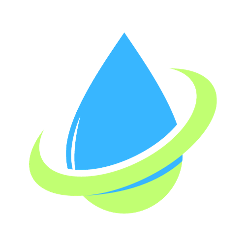

# knighthacks2023

 

    
<h3 align="center">Refill Radar</h3>
    

    
Utilized HTML - CSS - Javascript - Leaflet Library
Program Functionality:
The website enables users to detect bottle refill fountains to allow them to gain easy access while on campus. Users will be able to identify which refill fountain will be the most convenient for them.
Our Purpose: 
We identify the problem in our campus that clean drinking water is not very accessible around campus. We wanted our web solution to help students identify which locations are closest to them for increase convenience and encourage healthy water consumption habits.
Our Mission: 
Bottle refill stations not only prevent unsanitary water common in drinking fountains, they also encourage the reuse of water bottles. This program can reduce plastic waste on the University campus, creating a greener, more sustainable campus.
     
    <a href="https://github.com/WhitlockAdam/knighthacks2023"><strong>Our GitHub Repository</strong></a>
     
     
    <a href="https://whitlockadam.github.io/knighthacks2023/">View Demo</a>
    

    

